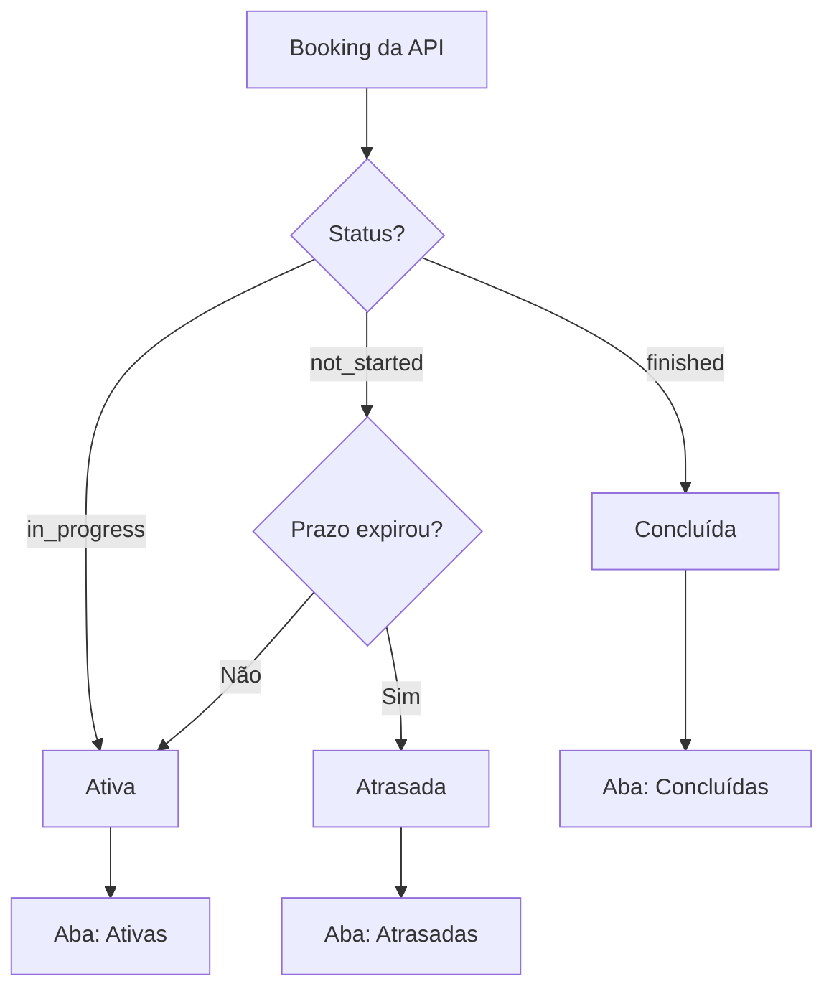

# 📅 Feature: Tarefas Atrasadas

## 📋 Resumo da Implementação

Implementada nova aba "Tarefas Atrasadas" no dashboard do aluno para diferenciar tarefas que não foram concluídas e já passaram do prazo (endTime) das tarefas que foram concluídas no prazo.

## ✅ Funcionalidades Implementadas

### 1. **Nova Aba no Dashboard do Aluno**
- ✅ Aba "Atrasadas" adicionada ao sistema de tabs
- ✅ Contador de tarefas atrasadas no título da aba
- ✅ Layout responsivo mantido

### 2. **Lógica de Classificação Atualizada**
```typescript
// Separar tarefas finalizadas em concluídas e atrasadas
const finalizadas = allTarefas.filter((t) => t.status === "finalizada")
const concluidas = finalizadas.filter((t) => !t.atrasada) // Concluídas no prazo
const atrasadas = finalizadas.filter((t) => t.atrasada === true) // Não concluídas e prazo expirado
```

### 3. **Componente TarefaCard Aprimorado**
**Nova prop adicionada:**
```typescript
interface TarefaCardProps {
  // ... props existentes
  atrasada?: boolean  // ✅ Nova prop
}
```

**Indicadores visuais para tarefas atrasadas:**
- ✅ Badge vermelho com ícone "Atrasada"
- ✅ Borda vermelha sutil no card
- ✅ Ícone AlertCircle para destaque

### 4. **Lógica de Status da API**
Baseada na documentação atualizada do GET bookings:

```typescript
// Para alunos: usar status da API
switch (booking.status) {
  case "finished":
    status = "finalizada"
    atrasada = false // ✅ Concluída no prazo
    break
  case "not_started":
    if (prazoExpirou) {
      status = "finalizada"
      atrasada = true // ✅ Não concluída e prazo expirado = atrasada
    }
    break
}
```

## 🎨 Interface do Usuário

### **Estrutura das Abas:**
1. **Ativas** - Tarefas em andamento
2. **Agendadas** - Tarefas futuras
3. **Concluídas** - Tarefas finalizadas no prazo
4. **Atrasadas** - Tarefas não concluídas após o prazo ⚠️

### **Indicadores Visuais:**
- 🟢 **Ativas**: Badge azul/verde do componente
- 🟡 **Agendadas**: Sem indicadores especiais
- ✅ **Concluídas**: Opacidade reduzida (60%)
- ❌ **Atrasadas**: Badge vermelho + borda vermelha

## 📊 Estados das Tarefas

| Status da API | Prazo | Resultado | Aba |
|---------------|-------|-----------|-----|
| `not_started` | Não expirado | `ativa` | Ativas |
| `not_started` | Expirado | `finalizada` + `atrasada: true` | **Atrasadas** |
| `in_progress` | Qualquer | `ativa` | Ativas |
| `finished` | Qualquer | `finalizada` + `atrasada: false` | Concluídas |

## 🔄 Fluxo de Classificação



## 🎯 Benefícios para o Usuário

### **Para Alunos:**
- ✅ **Visibilidade clara** de tarefas perdidas
- ✅ **Organização melhorada** do dashboard
- ✅ **Motivação** para não atrasar futuras tarefas
- ✅ **Feedback visual** imediato sobre status

### **Para Professores:**
- ✅ **Dados precisos** sobre conclusão de tarefas
- ✅ **Identificação fácil** de alunos com dificuldades
- ✅ **Métricas de engajamento** mais detalhadas

## 🚀 Exemplo de Uso

```typescript
// No dashboard do aluno
const { tarefasAtrasadas } = useMemo(() => {
  // ... lógica de classificação
  const atrasadas = finalizadas.filter((t) => t.atrasada === true)
  return { tarefasAtrasadas: atrasadas }
}, [bookings])

// Na interface
<TabsTrigger value="atrasadas">
  Atrasadas {tarefasAtrasadas.length > 0 && `(${tarefasAtrasadas.length})`}
</TabsTrigger>
```

## 📱 Responsividade

- ✅ **Mobile**: Layout de grid adaptativo
- ✅ **Tablet**: 2 colunas
- ✅ **Desktop**: 3 colunas
- ✅ **Badges**: Tamanho otimizado para todos os dispositivos

---

**Status**: ✅ Implementação completa e funcional  
**Última atualização**: Janeiro 2025